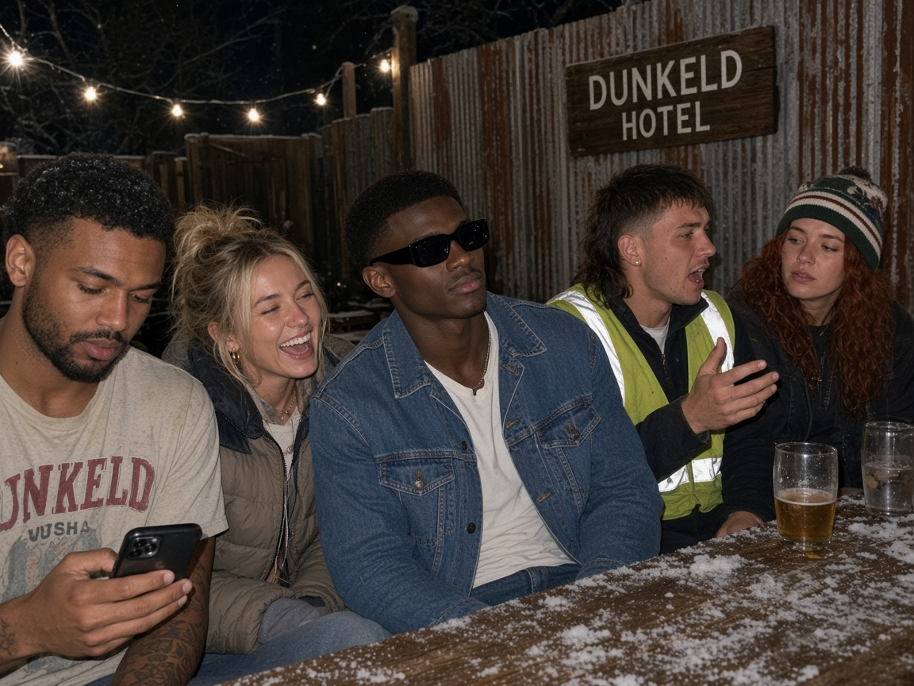
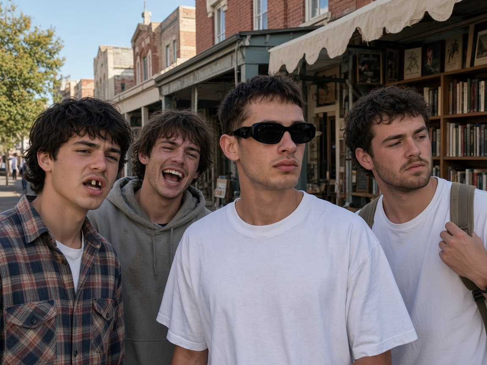
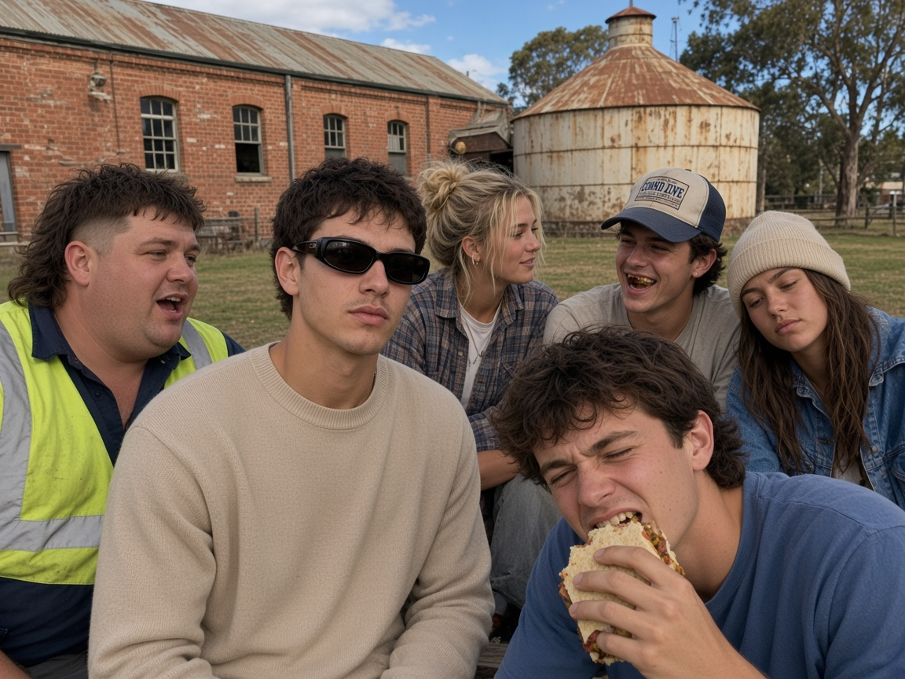
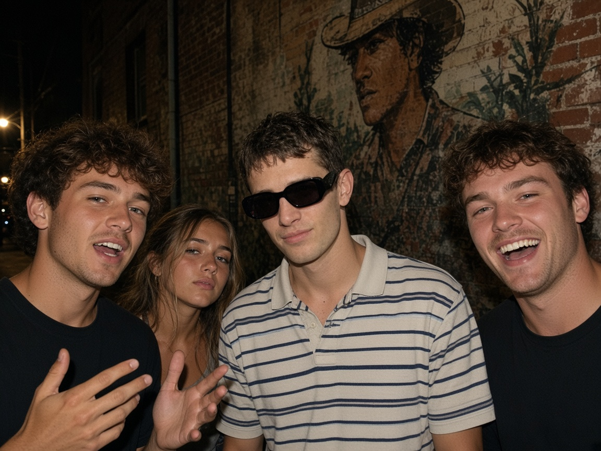
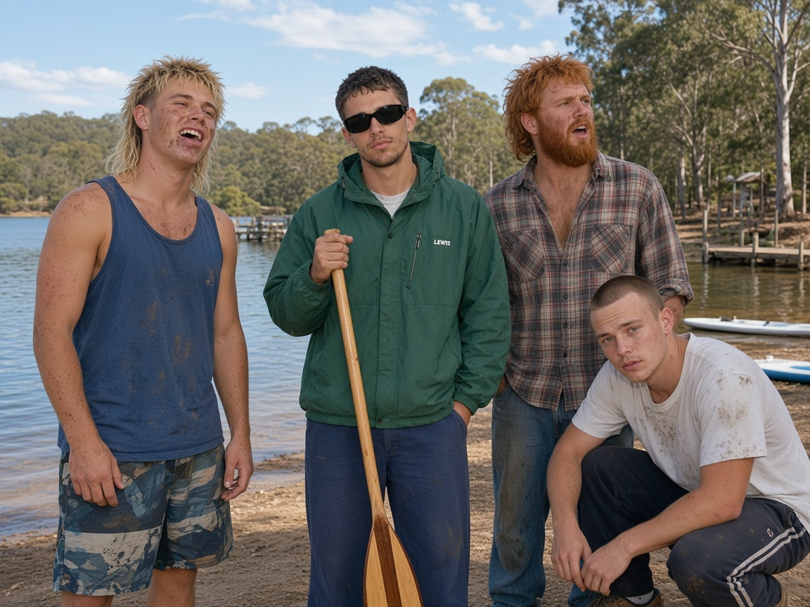
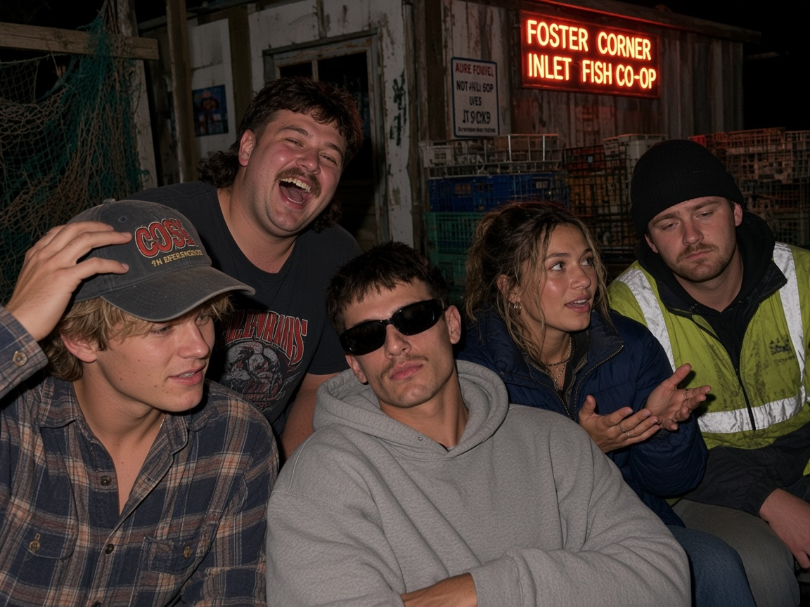
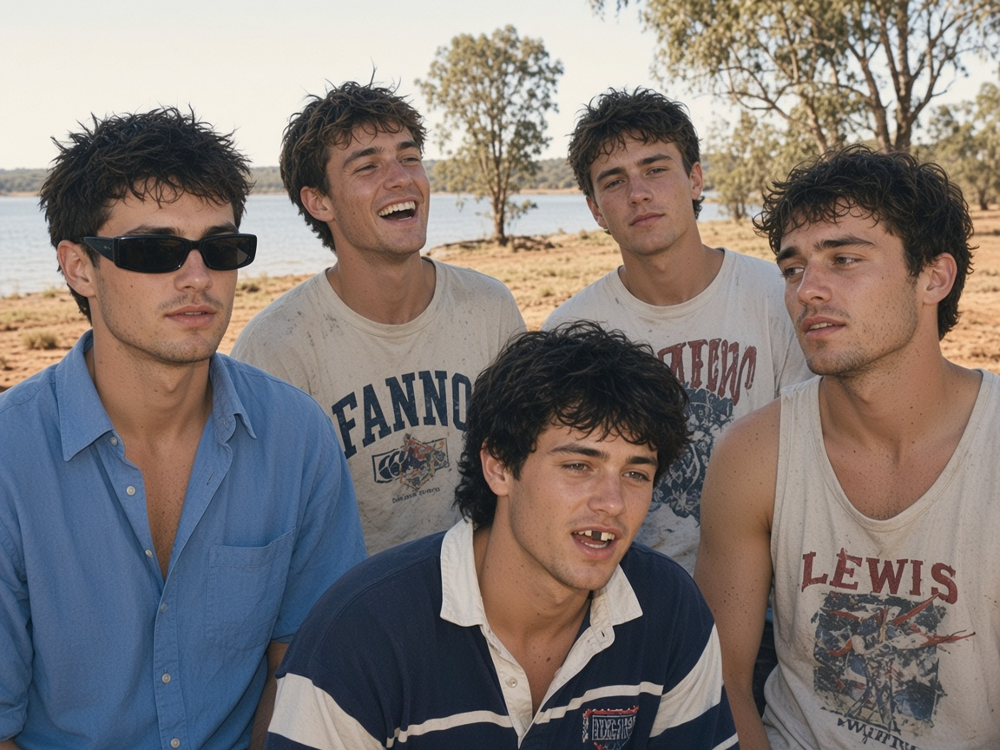
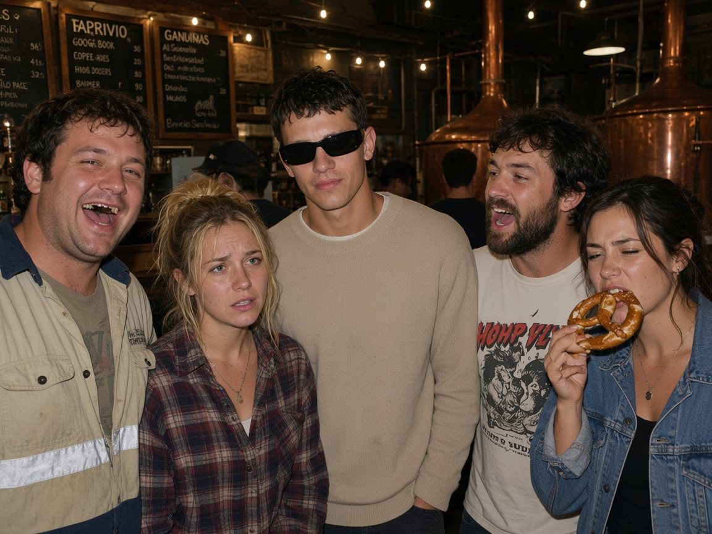

# Shots 816–852 (20 photos)

[← Album index](./INDEX.md)

## 816 — Ararat hotel TAB lounge pokies glow

[Open full size](./shots/lewis-0816.jpg)

## 817 — Aireys Inlet lighthouse walk arvo

[Open full size](./shots/lewis-0817.jpg)

## 818 — Bacchus Marsh twin cinemas sticky foyer

[Open full size](./shots/lewis-0818.jpg)

## 819 — Anglesea river mouth picnic soft sun

[Open full size](./shots/lewis-0819.jpg)

## 820 — Bairnsdale riverside boardwalk sodium night

[Open full size](./shots/lewis-0820.jpg)

## 821 — Avoca Pyrenees cellar door afternoon

[Open full size](./shots/lewis-0821.jpg)

## 822 — Benalla art gallery after-hours courtyard

[Open full size](./shots/lewis-0822.jpg)

## 823 — Ballan Werribee river picnic rug

[Open full size](./shots/lewis-0823.jpg)

## 824 — Bright alpine hotel beer garden heaters

[Open full size](./shots/lewis-0824.jpg)

## 825 — Beaufort goldfields park lunch

[Open full size](./shots/lewis-0825.jpg)

## 842 — Dunkeld Grampians pub beer garden frost

[Open full size](./shots/lewis-0842.jpg)

## 843 — Clunes booktown street browse

[Open full size](./shots/lewis-0843.jpg)

## 844 — Eaglehawk Bendigo suburb bowls club bar

[Open full size](./shots/lewis-0844.jpg)

## 845 — Cobden dairy heritage park day

[Open full size](./shots/lewis-0845.jpg)

## 846 — Euroa Ned Kelly mural laneway night

[Open full size](./shots/lewis-0846.jpg)

## 847 — Daylesford lake daylesford paddle

[Open full size](./shots/lewis-0847.jpg)

## 848 — Foster corner inlet fish co-op night

[Open full size](./shots/lewis-0848.jpg)

## 849 — Donald Buloke shire lake foreshore

[Open full size](./shots/lewis-0849.jpg)

## 850 — Gisborne Macedon ranges brewery taproom

[Open full size](./shots/lewis-0850.jpg)

## 852 — Hamilton pastoral museum carpark night

[Open full size](./shots/lewis-0852.jpg)

[← Album index](./INDEX.md)
