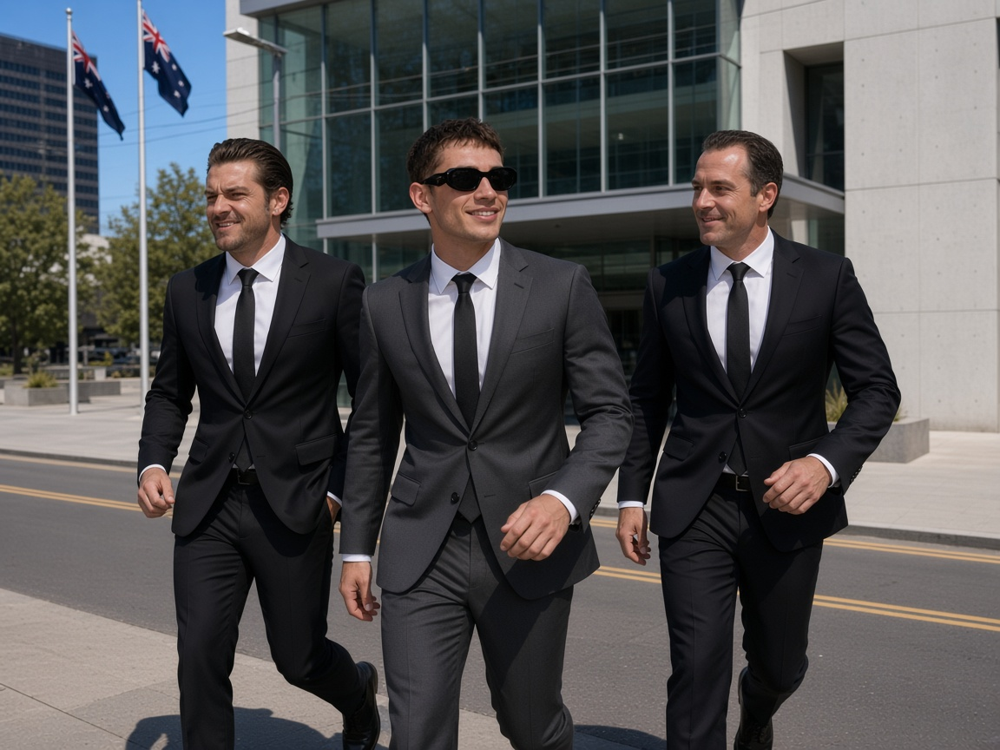
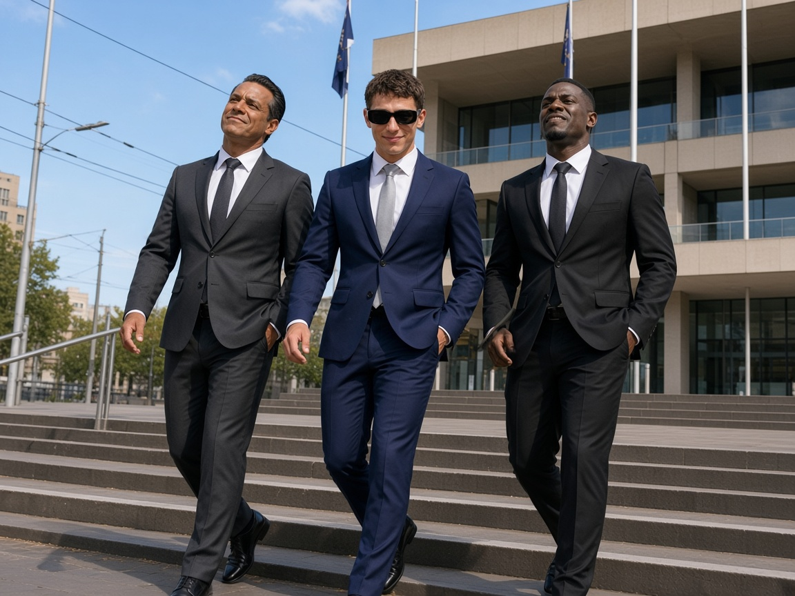
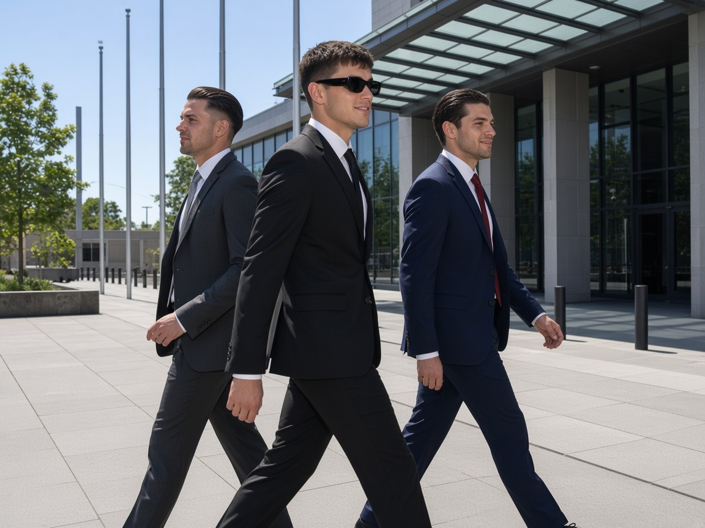
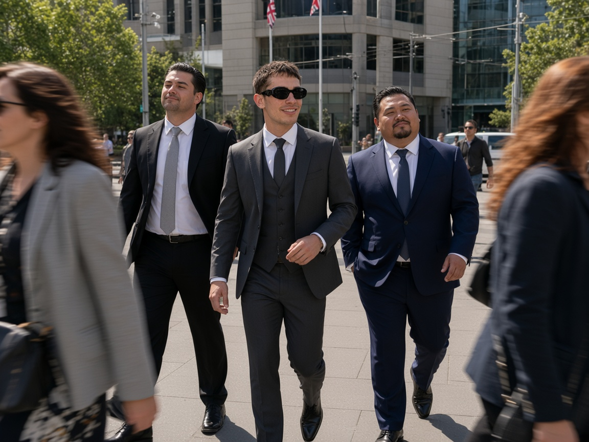
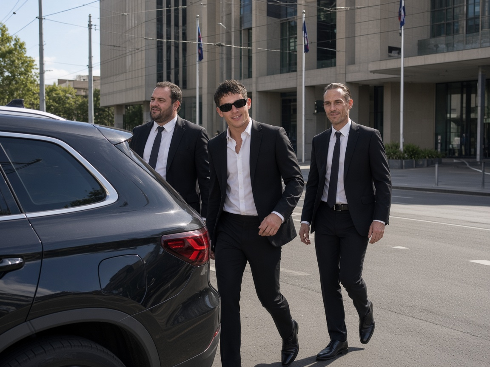
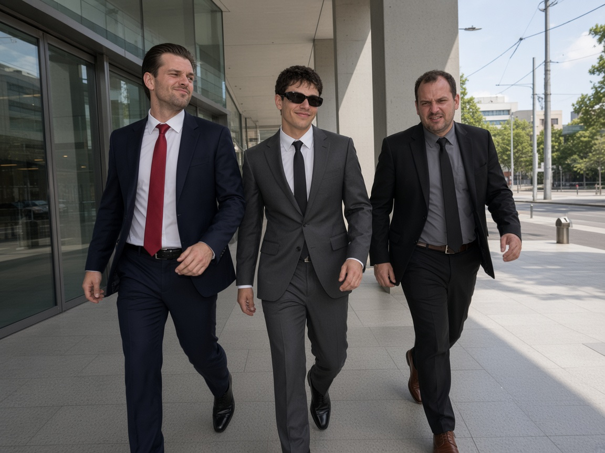
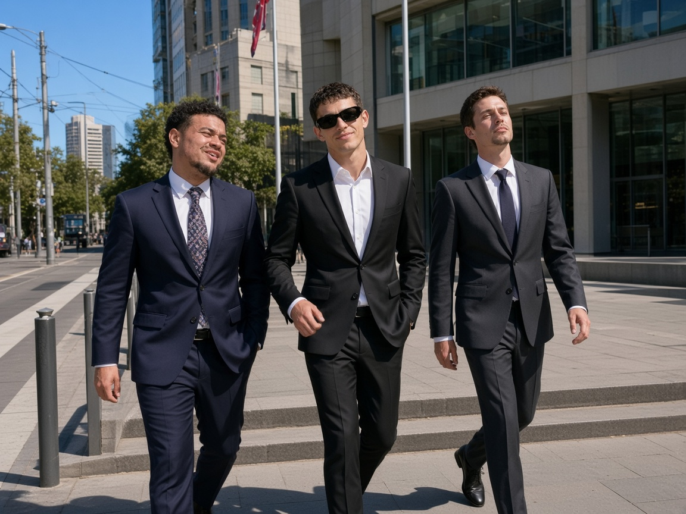
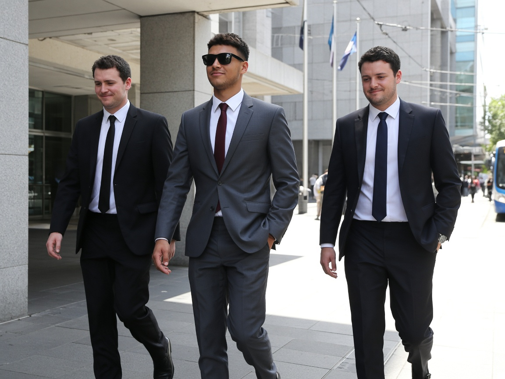
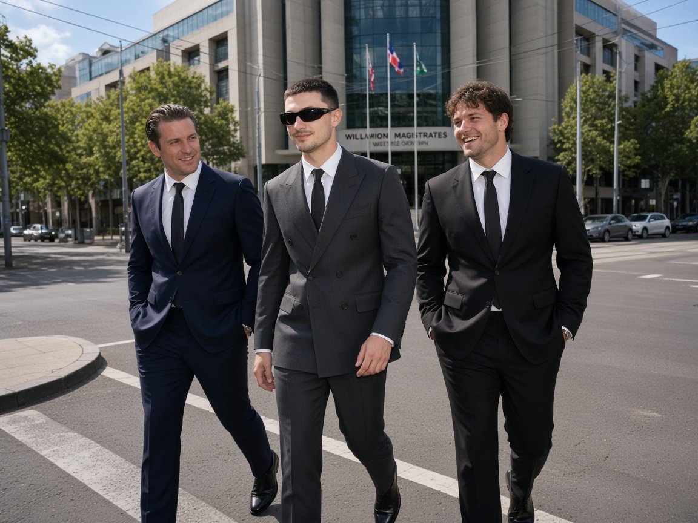

# Batch 019 — page 01

[Index](./INDEX.md) · [Phone view](./PHONE_VIEW.md)

## 1271

_long lens across William Street at Magistrates Court main entrance_

## 1272

_low angle from footpath bottom of Magistrates Court plaza steps_

## 1273

_side profile mid-stride past Magistrates glass canopy on William St_

## 1274

_through lunchtime pedestrians partial occlusion outside Magistrates_

## 1275

_zoom from behind parked black SUV on William St curb_

## 1276

_slight motion blur handheld chase as they clear Magistrates doors_

## 1277

_tight three-shot exiting revolving/glass doors of Magistrates Court_

## 1278

_wide facade shot of Magistrates Court with trio descending plaza_

## 1279

_under Magistrates covered entry into bright La Trobe street glare_

## 1280

_diagonal crosswalk at William and La Trobe corner outside Magistrates_

